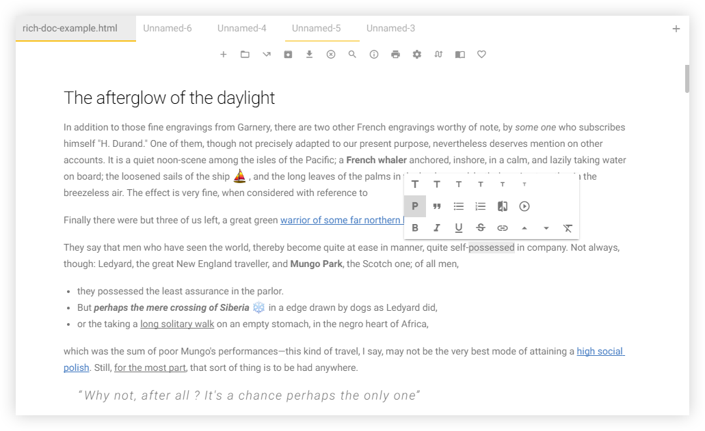

Next generation **desktop rich content editor** that saves documents with **themes**. **HTML & Markdown** compatible. For **Windows, OS X & Linux**.
#### version 0.8.1 — Beta

With (Un)colored, the user focuses on the **text** & **content types** (titles, lists, etc.), then selects the document **saving format**. If the selected format is **HTML**, the user can choose an export **document theme** which defines the appearance of the saved document, that can be viewed directly in a web browser. If the selected format is **Markdown**, the document is saved as raw Markdown file, without theme. A saved HTML / Markdown document can be re-imported in the editor and re-exported, with theme or not, **endlessly**.

### Supported Platforms
(Un)colored is provided for **64-bit systems only**, on **OS X 10.9** and later, **Windows 7** and later, **Linux** (**Ubuntu 12.04** and later, **Debian 8** and later).

### :package: Features *(for now)*
- **Multiple document tabs** management
- Standard word processor **inline tools** (bold, italic, underline, strikethrough, add link to selection, superscript, subscript, clear format)
- 6 levels **title tools**
- **Block tools** (paragraph, quote, unordered & ordered list, image insertion via URL)
- **Web-oriented tools** (**YouTube / Vimeo / Dailymotion / Twitch video** insertion via URL, or **ANY embedded content** (SoundCloud tracks, Vines, ...))
- Real-time **emojis** *(from http://www.emoji-cheat-sheet.com/ for now)*
- Export to **HTML documents** with 2 **themes** : GitHub Style & White Room *(more to come)*
- Export to **Markdown documents**
- **Interface themes** system *(1 interface theme for now, but more to come)*
- 41 **mouse & keyboard shortcuts**
- Basic **search / replace** system *(needs improvements)*
- Document information display (number of paragraphs, words, etc.)
- Minimalist interface that let you focus on what matters : **the content**
- Update auto-check system (enable / disable in settings)
- Built-in english **quick guide** *(more languages to come)*

### :checkered_flag: Roadmap
Here is what **is planed** for future releases of (Un)colored. These lists **can change** at any time and tasks can be added, moved, modified or deleted for several reasons, including **feasibility** and **performance impact**.

This **public repository** contains released versions of (Un)colored and their source code, **the latest development/test** version of the (Un)colored source code **is on a private repository**, **checked checkboxes are only for your information** but concerned features **are not testable** with the source code of this public repository.

If you want more details about what was done, see [the Changelog](CHANGELOG.md).

##### version 0.9.0
- [ ] Additional ***Tweet*** tool : **insert a tweet** from Twitter in documents
- [ ] **Anchor links** (links starting with "#") full support (fixing issue ***KI001M***)
- [ ] **GitHub Flavored Markdown** documents import/export full support (tools will come progressively) (fixing issue ***KI002M***)
- [ ] Additional ***Insert Image from File*** tool (fixing issue ***KI003M*** at the same time)
- [ ] Additional **document themes**
- [ ] **Code highlighting** in saved themed document (supported languages : CSS, JavaScript, Ruby, CoffeeScript, PHP, SQL, C#, Diff, JSON, Markdown, C++, HTML, XML, Java, Python)
- **Other potential issue fixes**

##### version 0.10.0
- [ ] Additional **table tools** : insert table & add, remove, move row & column
- [ ] Additional ***Incorporate image from file*** tool
- **Potential issue fixes**

##### version 1.0.0
- [ ] **Emojis** insertion **via the toolbar**
- [ ] Additional **text tools** : selection to lower / upper / title case
- [ ] **Multi-Language** Support & **French** language implementation
- **Potential issue fixes**

##### :page_facing_up: Writing Time
- [ ] Documentation about how to **create a document theme**
- [ ] Documentation about how to **create a UI theme**
- [ ] **Proper code comments** with links to :us: English documentations (and :fr: French if possible)

### :nut_and_bolt: Technical Details
(Un)colored is made to be **fast** & fully compatible with **WebKit** web browser engine and **V8** JavaScript engine (those implemented in Google Chrome). So the application is entirely written without any compatibility fallback code and allows using **latest** web technologies.

- **ES6** : Object Oriented & more beautiful than classic JavaScript.
- **No jQuery** or other JS framework, for maximum performance.

For the complete list of used projects, see below the [Related Projects section](#related-projects).

### :warning: Known Issues
- *[Major issue]* Anchor links (links starting with "#") doesn't work. ***(id : KI001M)***
- *[Major issue]* GitHub Flavored Markdown documents import/export not fully supported (and missing tools for it). ***(id : KI002M)***
- *[Major issue]* When entering a local image relative path in the *Image via URL* tool field, the image in the exported document is not visible in-browser. ***(id : KI003M)***

### :busts_in_silhouette: Contribute
If you have any **question** about the project, noticed a performance **issue** or a **bug**, you can let me know by posting on [the GitHub issues section](https://github.com/n457/Uncolored/issues?utf8=%E2%9C%93&q=). I will be glad to answer :octocat:

Before creating a new issue topic, be careful to check if your question/issue is not in the [Known Issues section](#known-issues) above or already in [the GitHub issues section](https://github.com/n457/Uncolored/issues?utf8=%E2%9C%93&q=).

### :wrench: Technical Documentation *(not ready yet)*
To know how to **create a document theme** or a **interface theme**, how to **launch the development version** of (Un)colored, **how to build it** or **how it's made**, see [the Full Documentation](project/docs/README.md).

### :gift: Donation
[— Donate Link —](https://www.paypal.com/cgi-bin/webscr?cmd=_donations&business=n457%2econtact%40gmail%2ecom&lc=FR&item_name=n457%20%2f%20Bertrand%20Vignaud%2dLerouge&currency_code=EUR&bn=PP%2dDonationsBF%3abtn_donateCC_LG%2egif%3aNonHosted)

**(Un)colored is free and open source**. Making applications like this **takes time**. If you like this app, please consider to donate to **support my work** :wink:
If you don't know how much to give, 6 € is a reasonnable amount (will be automatically converted into your currency). Have a nice day !

### :page_facing_up: License
(Un)colored is released under the [Apache License 2.0](LICENSE). More information on http://choosealicense.com/licenses/apache-2.0/

### :heart: Related Projects
**Thanks to creators and contributors of these open source projects that (Un)colored proudly uses :**

[Countable.js](https://sacha.me/Countable/) •
[DOMPurify](https://cure53.de/purify) •
[Electron](http://electron.atom.io/) •
[electron-builder](https://github.com/electron-userland/electron-builder) •
[emojify.js](http://hassankhan.me/emojify.js/) •
[findAndReplaceDOMText](https://github.com/padolsey/findAndReplaceDOMText) •
[foreach.js](https://github.com/toddmotto/foreach) •
[getmdl-select](http://creativeit.github.io/getmdl-select/) •
[github-markdown-css](https://sindresorhus.com/github-markdown-css/) •
[jsVideoUrlParser](https://github.com/Zod-/jsVideoUrlParser) •
[LightRange.js](http://n457.github.io/LightRange.js/) •
[marked](https://github.com/chjj/marked) •
[Material Design Lite](https://getmdl.io/) •
[Mousetrap](https://craig.is/killing/mice) •
[Mousetrap Global Bind](https://github.com/ccampbell/mousetrap/tree/master/plugins/global-bind) •
[Normalize.css](http://necolas.github.io/normalize.css/) •
[reqwest](https://github.com/ded/reqwest) •
[Sortable](http://rubaxa.github.io/Sortable/) •
[to-markdown](http://domchristie.github.io/to-markdown/) •
[versions-compare](https://gist.github.com/alexey-bass/1115557) •
[wysiwyg.js](http://wysiwygjs.github.io/)

Proudly powered by [Electron](http://electron.atom.io/)

